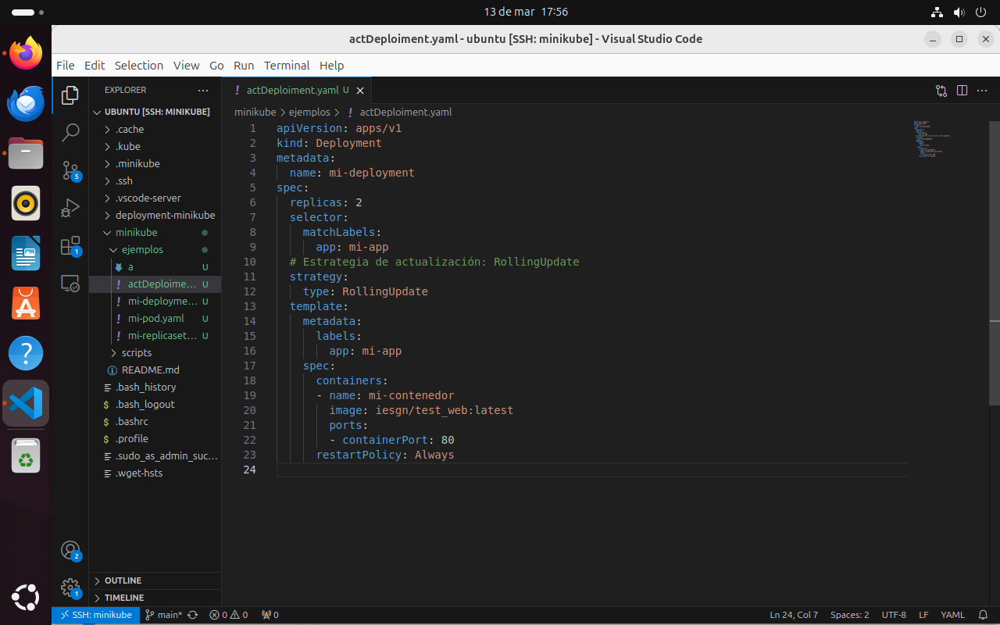
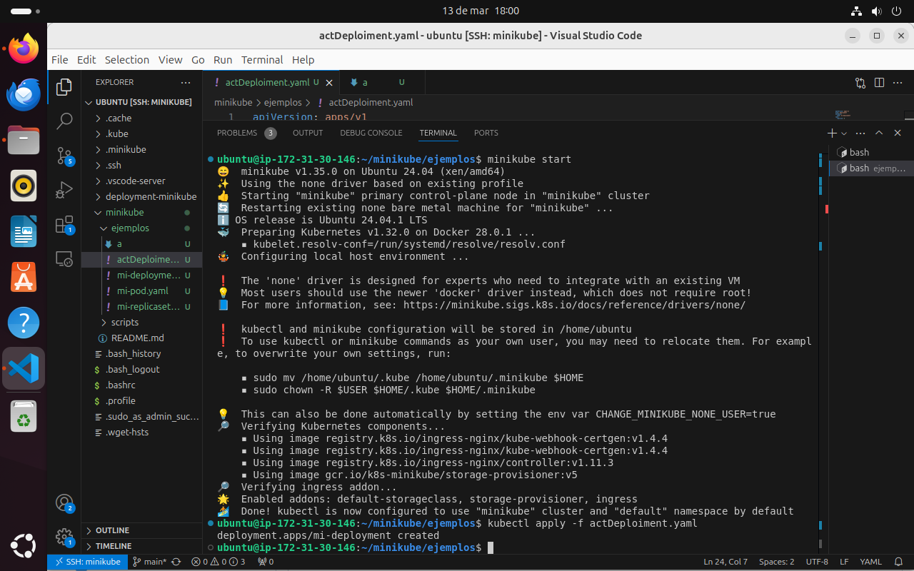
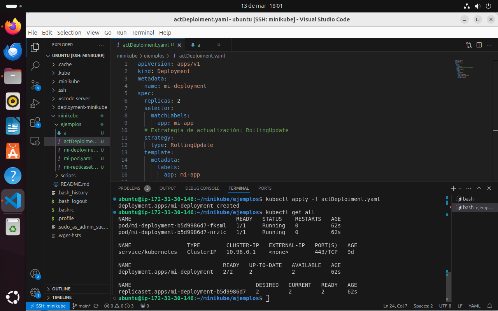
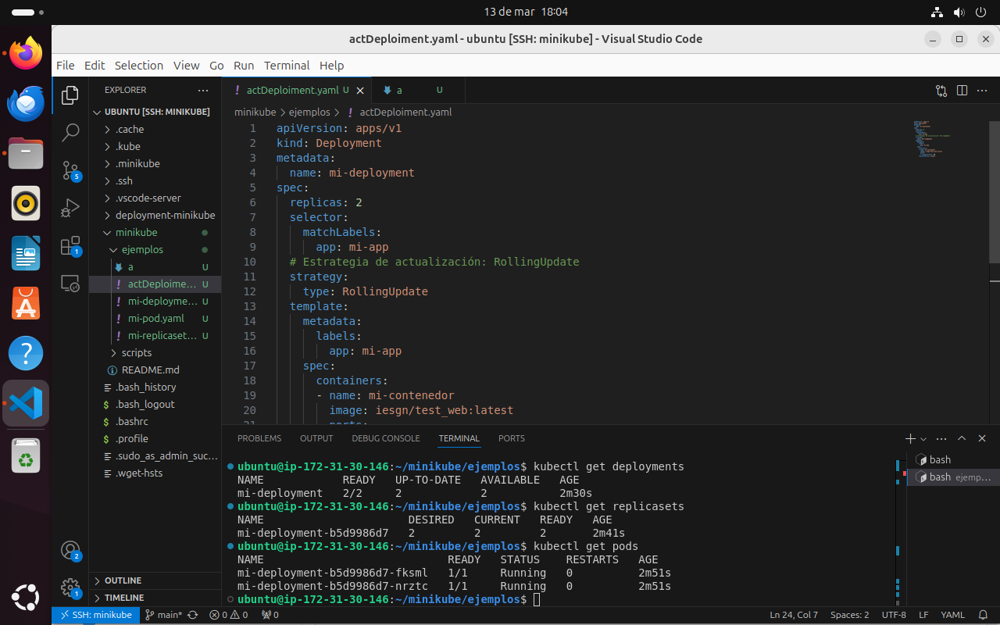
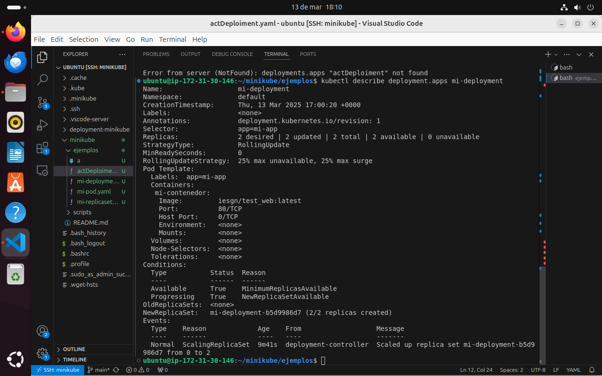
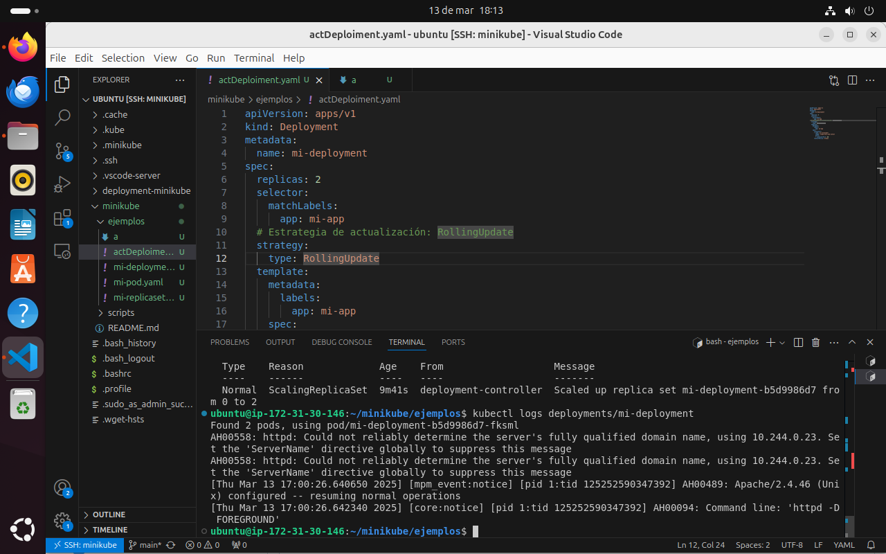
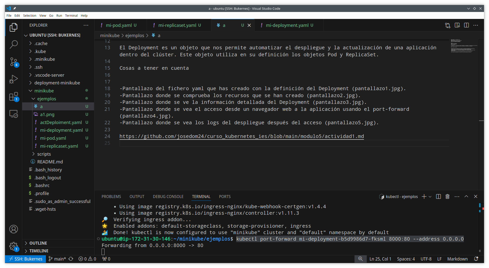
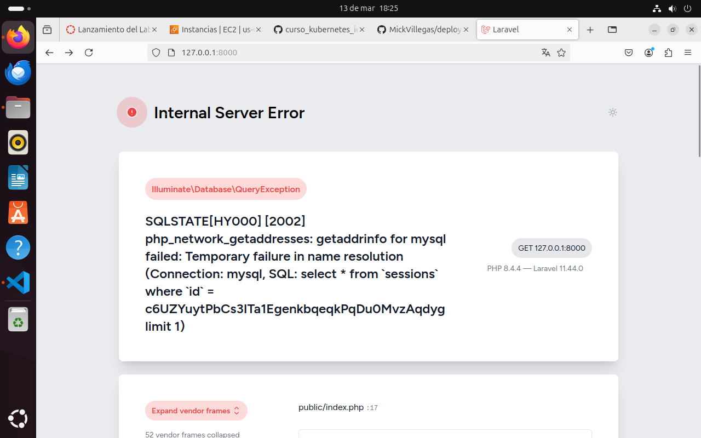

# deployment-minikube

Definicion del deployment



Inicio minikube con  

```
minikube start
```

Y creo el deployment con

```
kubectl  apply -f actDeploiment.yaml
```



Comprobación de los recursos creados con  

```
kubectl  get all
```



Reviso por separado los recursos creados
- deployments

  ```
  kubectl get delpoyments 
  ```

- replicas

  ```
  kubectl get replicasets
  ```

- pods
 
  ```
  kubectl get pods 
  ```



Informacion detallada del deployment con  

```
kubectl describe deployment.apps mi-deployment
```



Informacion sobre los logs con  

```
kubectl logs deployments/mi-deployment
```



Acceso desde un navegador web a la aplicación usando el port-forward y busco en el navegador la ip y el puerto

```
kubectl port-forward mi-deployment-b5d9986d7-fksml 8000:80 --address 0.0.0.0
```



